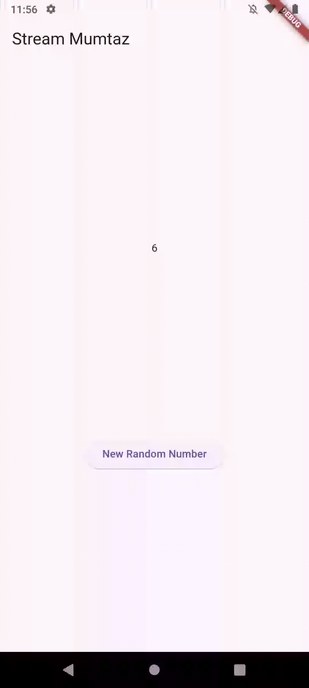
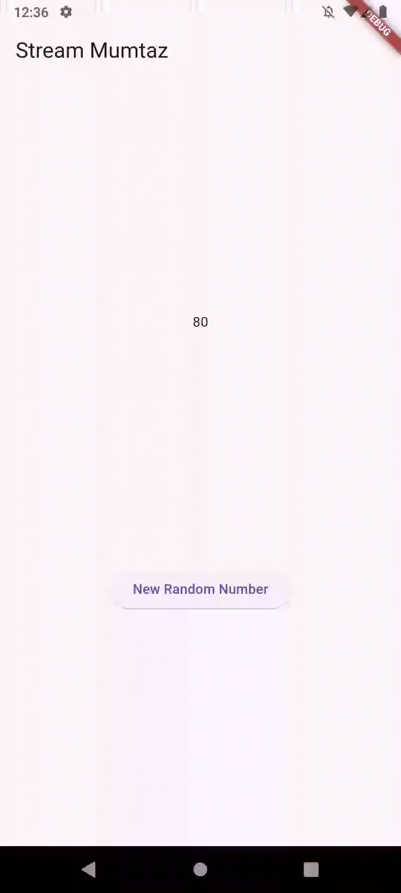

# stream_mumtaz

Soal 3\
yield* digunakan untuk mengembalikan nilai dari stream yang diberikan oleh Stream.periodic.\
Kode tersebut merupakan kode yang digunakan untuk membuat stream yang akan mengeluarkan warna setiap 1 detik. 

Soal 4\

Soal 5\
Perbedaan utama antara listen dan await for adalah cara mereka menangani stream. Metode listen bersifat non-blocking, sehingga kode berikutnya tetap dieksekusi tanpa menunggu semua data diterima, cocok untuk memproses data secara real-time dengan callback. Sebaliknya, await for bersifat blocking dalam async function, sehingga menunggu seluruh data dari stream selesai diterima sebelum melanjutkan eksekusi, lebih cocok untuk proses sekuensial.

Soal 6
- Langkah 8 menginisialisasi sebuah stream untuk mendengarkan perubahan data pada stateful widget. Pada fungsi initState, sebuah objek NumberStream dibuat bersama dengan controller-nya (NumberStreamController). Kemudian, stream dari controller tersebut didaftarkan menggunakan listen, sehingga setiap kali ada data baru (event) yang diterima, fungsi callback akan dipanggil untuk memperbarui nilai lastNumber melalui setState. Ini memungkinkan tampilan untuk secara dinamis menampilkan nilai terbaru dari stream.
- Langkah 10 fungsi yang menghasilkan angka acak antara 0 hingga 9 dan menambahkannya ke sink milik sebuah stream. Fungsi addRandomNumber menggunakan objek Random untuk menghasilkan angka acak (myNum) dengan metode nextInt(10), lalu memanggil metode addNumberToSink dari numberStream untuk mengirimkan angka tersebut ke stream. Angka yang ditambahkan ini nantinya dapat diterima oleh listener yang terdaftar pada stream.

Soal 7
- Langkah ke 13 berfungsi untuk menambahkan kesalahan (error) ke dalam stream. Dengan memanggil controller.sink.addError('error'), pesan 'error' dikirimkan sebagai kesalahan kepada semua listener yang mendengarkan stream tersebut. Hal ini berguna untuk mensimulasikan atau menangani skenario error dalam alur data stream.
- Langkah ke 14 mendengarkan data dari sebuah stream menggunakan listen, di mana setiap data baru (event) yang diterima akan memperbarui nilai lastNumber melalui setState. Jika terjadi kesalahan selama proses (error), callback pada onError akan dipanggil untuk mengatur lastNumber menjadi -1, menunjukkan adanya kesalahan. Hal ini memastikan aplikasi dapat menangani data normal maupun kesalahan dari stream.
- Langkah ke 15 berfungsi yang menambahkan sebuah error ke stream menggunakan metode addError milik numberStream. Tidak seperti data biasa, error ini akan diterima oleh listener atau subscriber yang terdaftar sebagai sebuah kejadian error, sehingga bisa digunakan untuk mengelola atau menangani situasi khusus seperti kesalahan selama pengolahan data pada stream.

Soal 8\
Kode diatas menggunakan sebuah StreamTransformer untuk memproses data dari stream sebelum diteruskan ke listener. Transformer ini mengalikan setiap nilai yang diterima dengan 10 menggunakan handleData, menangani kesalahan dengan mengirimkan nilai -1 melalui handleError, dan menutup sink saat stream selesai melalui handleDone. Stream yang telah diubah (transform) didengarkan dengan listen, yang memperbarui lastNumber setiap kali ada data baru atau kesalahan dengan nilai yang sesuai.

Soal 9
- Langkah ke 2 yaitu Di dalam fungsi initState, sebuah objek NumberStream dibuat, yang memiliki controller sebagai sumber data. Sebuah stream didaftarkan ke controller.stream, dan mendengarkan setiap perubahan data dengan metode listen. Ketika ada data baru (event) pada stream, widget diperbarui menggunakan setState untuk memperbarui nilai lastNumber. Fungsi super.initState() memastikan state widget diinisialisasi dengan benar.
- Langkah ke 6 ini digunakan untuk menghentikan subsciption terhadap stream yang sedang didengarkan. Metode ini agar mencegah kebocoran memory.
- Langkah ke 8 ini yaitu Fungsi addRandomNumber digunakan untuk menghasilkan angka acak antara 0 hingga 9 menggunakan kelas Random. Angka tersebut kemudian ditambahkan ke stream melalui metode addNumberToSink pada objek numberStream, jika numberStreamController belum ditutup (!isClosed). Jika controller sudah ditutup, fungsi mengubah nilai lastNumber menjadi -1 melalui setState, menandakan bahwa tidak ada angka yang dapat ditambahkan ke stream. Fungsi ini memastikan hanya data valid yang ditambahkan ke stream selama masih aktif.

Soal 10
Terjadi error karena terdapat dua langganan (subscriptions) secara bersamaan untuk satu stream (stream.listen). Pada stream default di Dart (non-broadcast stream), hanya satu pendengar (listener) yang diizinkan pada satu waktu. Jika menambahkan pendengar kedua seperti pada subscription2, akan muncul error "Stream has already been listened to".

Soal 11
Karena asBroadcastStream() digunakan untuk mengubah single-subscription menjadi broadcast stream, yang awalnya hanya satu pendengar sekarang dapat digunakan untuk banyak pendengar.
